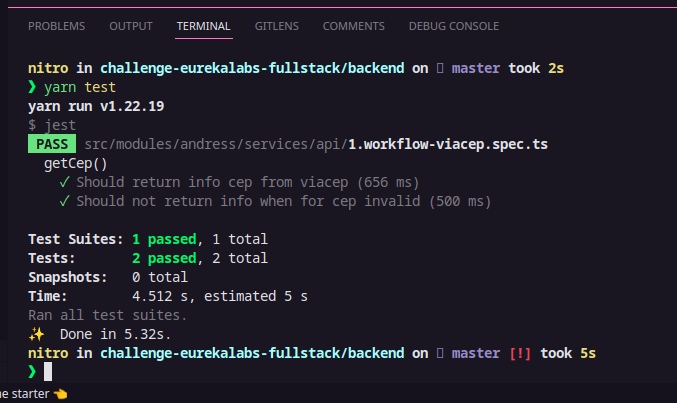
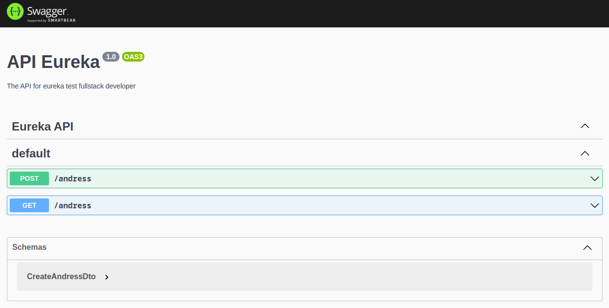
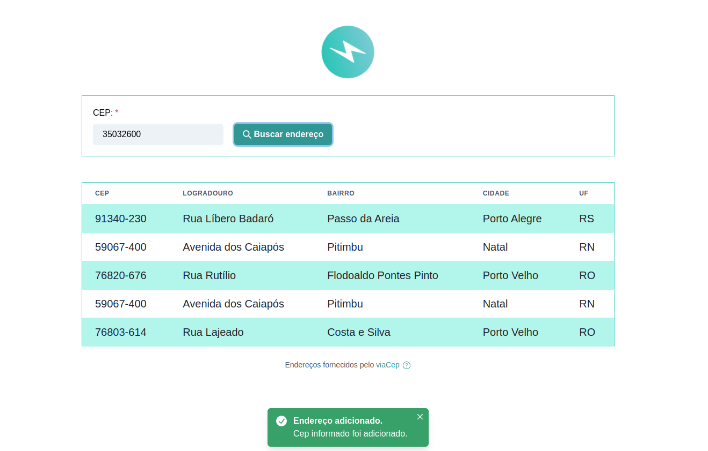
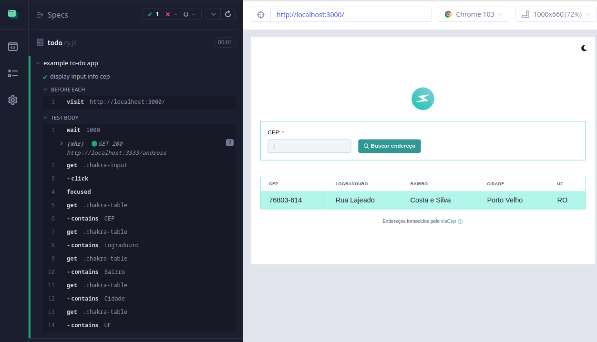

### challenge-eureka-labs-fullstack

## Tech Stack

**Client:** React, Chakra ui, Axios, Cypress

**Server:** Nest.js, PostgreSQL, Typeorm, Docker, Jest.js,

## Installation

Clone the project

```bash
  git clone https://github.com/viniciusnascimento95/challenge-eureka-labs-fullstack.git

  cd challenge-eureka-labs-fullstack
```

# Backend

### Directory project backend

    .
    ├── backend                 # Aplication server
    ├── frontend                # Aplication client
    └── README.md

Go to the project directory

```bash
  cd backend
```

Install dependencies NPM

```bash
  npm install
```

## Docker

Start database PostgreSQL

```bash
  docker-compose up
```

Run migrations api backend

```bash
  npm run typeorm migration:run
```

Start backend

```bash
  npm run start:dev
```

## Running Tests

To run tests, run the following command

```bash
  npm run test
```

## Screenshots backend test unit



## API docs run in http://localhost:3333/api



## Frontend

Go to the project directory

```bash
  cd frontend
```

Install dependencies NPM

```bash
  npm install
```

Start web server Local: http://localhost:3000

```bash
  npm start
```

## Screenshots frontend



## Result test e2e with Cypress



### Obrigatório

- [x] Um banco de dados de sua preferência para armazenar os dados de consulta,
      pode ser um banco SQL ou NOSQL;
- [x] Um Readme com visão geral do projeto, que explique como rodar o projeto e testes
      se possuir;
- [x] Incluir prints da tela do teste

### Desejável

- [x] Utilize uma arquitetura para o projeto que ache adequado para demonstrar seus
      conhecimentos.
- [x] Boa experiência para o usuário usando a aplicação web;
- [x] Testes;

## Authors

[@viniciusnascimento95](https://www.github.com/viniciusnascimento95)
[](https://www.linkedin.com/in/vin%C3%ADcius-nascimento-027507159/)
